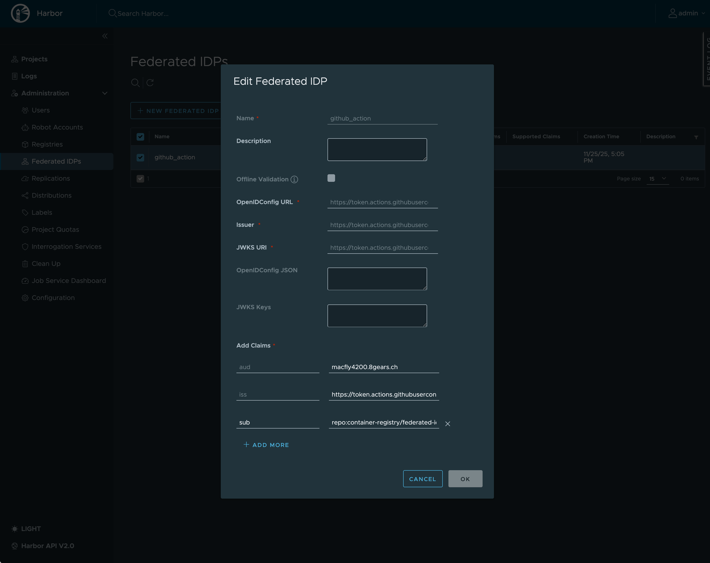

# Workload Identity Federation Examples to Push/Pull container Images Without Secrets

Repository with examples demonstrating how to use Harbor/8gears Container Registry with Workload Identity Federation, eliminating the need for static secrets in CI/CD pipelines and Kubernetes.

## Overview

**Workload Identity Federation** allows Harbor to authenticate clients using short-lived JWTs instead of static robot account secrets. By establishing a trust relationship with an external Identity Provider (like GitHub Actions, GitLab CI, or Kubernetes), Harbor can validate tokens and map them to internal robot accounts based on specific claims.

### Benefits

- **No static secrets**: Eliminate the operational burden of managing pull secrets
- **Enhanced security**: Use ephemeral, workload-specific credentials
- **Simplified rotation**: No secret rotation required since tokens are short-lived
- **Audit trail**: Better traceability of which workload accessed the registry

## Supported Identity Providers

- GitHub Actions
- GitLab CI
- Kubernetes 1.34+ (via Service Account tokens)
- FluxCD
- Forgejo Actions (TBD)

---

## GitHub Actions Example

This example demonstrates how to authenticate to Harbor from a GitHub Actions workflow using OIDC tokens.

### Prerequisites

1. **Harbor Setup**: Configure a Federated Identity Provider in Harbor:
   - OpenID Configuration URL: `https://token.actions.githubusercontent.com/.well-known/openid-configuration`
   - JWKS URI: Automatically discovered
   - Issuer: Automatically discovered

   

2. **Robot Account**: Create a federated robot account in Harbor with claim rules matching your GitHub repository:
   - `iss`: `https://token.actions.githubusercontent.com`
   - `aud`: `<your-registry-domain>` (e.g., `macfly4200.8gears.ch`) — The audience can be any string, but using your registry domain is recommended. This ensures tokens are scoped specifically to your registry and prevents token reuse across different services.
   - `repository`: `<owner>/<repo>` (e.g., `myorg/myrepo`)

### Workflow Configuration

See a [successful run example](https://github.com/container-registry/federated-idp-examples/actions/runs/19678450809).

```yaml
name: Create Image and Push Using federated IDP

on:
  workflow_dispatch:

jobs:
  build-and-push:
    runs-on: ubuntu-latest
    permissions:
      id-token: write   # Required for OIDC JWT
      contents: read

    steps:
      - name: Checkout
        uses: actions/checkout@v4

      - name: Get OIDC token
        id: oidc
        run: |
          echo "Requesting OIDC token"
          RESPONSE=$(curl -s -H "Authorization: bearer $ACTIONS_ID_TOKEN_REQUEST_TOKEN" \
          "${ACTIONS_ID_TOKEN_REQUEST_URL}&audience=<your-registry-domain>")

          TOKEN=$(echo "$RESPONSE" | jq -r '.value')
          echo "TOKEN=$TOKEN" >> $GITHUB_ENV

      - name: Build and Push Image
        run: |
          echo $TOKEN | docker login -u not-relevant --password-stdin <your-registry-domain>
          docker build -t <your-registry-domain>/library/image:${{ github.sha }} .
          docker push <your-registry-domain>/library/image:${{ github.sha }}

      - name: Pull Image from Registry
        run: |
          echo $TOKEN | docker login -u not-relevant --password-stdin <your-registry-domain>
          docker pull <your-registry-domain>/library/hello-world:latest
```

### Key Points

1. **Permissions**: The workflow must have `id-token: write` permission to request OIDC tokens.

2. **Audience**: The `audience` parameter in the token request must match the audience configured in your Harbor Federated Identity Provider (typically your registry domain).

3. **Username**: The username for `docker login` is not used for authentication (can be any value like `not-relevant`). Authentication is based solely on the JWT token.

4. **Token Claims**: GitHub Actions OIDC tokens include claims such as:
   - `iss`: Issuer (always `https://token.actions.githubusercontent.com`)
   - `aud`: Audience (your registry domain)
   - `sub`: Subject (e.g., `repo:owner/repo:ref:refs/heads/main`)
   - `repository`: Repository name
   - `repository_owner`: Repository owner
   - `actor`: User who triggered the workflow
   - `ref`: Git reference
   - `sha`: Commit SHA

### Debugging JWT Tokens

To inspect the JWT token contents during workflow execution:

```yaml
- name: Debug JWT Token
  run: |
    echo "=== JWT Header ==="
    echo "$TOKEN" | cut -d'.' -f1 | base64 -d 2>/dev/null | jq .
    echo ""
    echo "=== JWT Payload ==="
    echo "$TOKEN" | cut -d'.' -f2 | base64 -d 2>/dev/null | jq .
```

### Example JWT Token

Here's an example of what a GitHub Actions OIDC token looks like:

**JWT Header:**
```json
{
  "alg": "RS256",
  "kid": "38826b17-6a30-5f9b-b169-8beb8202f723",
  "typ": "JWT",
  "x5t": "ykNaY4qM_ta4k2TgZOCEYLkcYlA"
}
```

**JWT Payload:**
```json
{
  "actor": "Vad1mo",
  "actor_id": "1492007",
  "aud": "macfly4200.8gears.ch",
  "base_ref": "",
  "check_run_id": "56363837828",
  "event_name": "workflow_dispatch",
  "exp": 1764090768,
  "head_ref": "",
  "iat": 1764090468,
  "iss": "https://token.actions.githubusercontent.com",
  "job_workflow_ref": "container-registry/federated-idp-examples/.github/workflows/example_1.yml@refs/heads/main",
  "job_workflow_sha": "15a5ebfa3fb5ddf10c4b4250e14496bec7f03a56",
  "jti": "6cf8862b-b832-4372-9998-22026ecd21a1",
  "nbf": 1764090168,
  "ref": "refs/heads/main",
  "ref_protected": "false",
  "ref_type": "branch",
  "repository": "container-registry/federated-idp-examples",
  "repository_id": "1104004353",
  "repository_owner": "container-registry",
  "repository_owner_id": "46576199",
  "repository_visibility": "public",
  "run_attempt": "1",
  "run_id": "19677834613",
  "run_number": "4",
  "runner_environment": "github-hosted",
  "sha": "15a5ebfa3fb5ddf10c4b4250e14496bec7f03a56",
  "sub": "repo:container-registry/federated-idp-examples:ref:refs/heads/main",
  "workflow": "Create Image and Push Using federated IDP",
  "workflow_ref": "container-registry/federated-idp-examples/.github/workflows/example_1.yml@refs/heads/main",
  "workflow_sha": "15a5ebfa3fb5ddf10c4b4250e14496bec7f03a56"
}
```

**Key claims for Harbor claim rules:**
| Claim | Description | Example Value |
|-------|-------------|---------------|
| `iss` | Token issuer | `https://token.actions.githubusercontent.com` |
| `aud` | Target audience (your registry) | `macfly4200.8gears.ch` |
| `sub` | Subject identifier | `repo:container-registry/federated-idp-examples:ref:refs/heads/main` |
| `repository` | Full repository name | `container-registry/federated-idp-examples` |
| `repository_owner` | Organization or user | `container-registry` |
| `ref` | Git reference | `refs/heads/main` |
| `actor` | User who triggered the workflow | `Vad1mo` |

---

## GitLab CI Example

This example demonstrates how to authenticate to Harbor from a GitLab CI pipeline using OIDC tokens.

### Prerequisites

1. **Harbor Setup**: Configure a Federated Identity Provider in Harbor:
   - OpenID Configuration URL: `https://gitlab.com/.well-known/openid-configuration`
   - JWKS URI: Automatically discovered 
   - Issuer: Automatically discovered

2. **Robot Account**: Create a federated robot account in Harbor with claim rules matching your GitLab project:
   - `iss`: `https://gitlab.com`
   - `aud`: `<your-registry-domain>` (e.g., `macfly4200.8gears.ch`)
   - `project_path`: `<namespace>/<project>` (e.g., `8gears/container-registry/harbor-workload-identity-federation`)

### Pipeline Configuration

```yaml
stages:
  - build

build-and-push:
  stage: build
  image: docker:latest
  services:
    - docker:dind
  id_tokens:
    ID_TOKEN:
      aud: <your-registry-domain>  # 👈 audience claim matching your registry
  variables:
    DOCKER_HOST: tcp://docker:2375
    DOCKER_TLS_CERTDIR: ""
  script:
    # Login to registry using JWT token
    - echo "$ID_TOKEN" | docker login -u not-relevant --password-stdin <your-registry-domain>

    # Build and push image
    - docker build -t <your-registry-domain>/library/image:$CI_COMMIT_SHA .
    - docker push <your-registry-domain>/library/image:$CI_COMMIT_SHA
  rules:
    - when: manual
```

### Key Points

1. **id_tokens**: GitLab CI uses the `id_tokens` keyword to request OIDC tokens. The token is automatically available as `$ID_TOKEN`.

2. **Audience**: The `aud` field under `id_tokens` must match the audience configured in your Harbor Federated Identity Provider.

3. **Username**: The username for `docker login` is not used for authentication (can be any value like `not-relevant`). Authentication is based solely on the JWT token.

4. **Token Claims**: GitLab CI OIDC tokens include claims such as:
   - `iss`: Issuer (always `https://gitlab.com` for gitlab.com)
   - `aud`: Audience (your registry domain)
   - `sub`: Subject (e.g., `project_path:8gears/container-registry/harbor-workload-identity-federation:ref_type:branch:ref:main`)
   - `project_path`: Full project path
   - `namespace_path`: Group/namespace path
   - `ref`: Git reference
   - `user_login`: User who triggered the pipeline

### Example JWT Token

Here's an example of what a GitLab CI OIDC token looks like:

**JWT Header:**
```json
{
  "kid": "4i3sFE7sxqNPOT7FdvcGA1ZVGGI_r-tsDXnEuYT4ZqE",
  "typ": "JWT",
  "alg": "RS256"
}
```

** GitLab JWT Payload:**
```json
{
  "project_id": "76366029",
  "project_path": "8gears/container-registry/harbor-workload-identity-federation",
  "namespace_id": "1087575",
  "namespace_path": "8gears/container-registry",
  "user_id": "907142",
  "user_login": "vad1mo",
  "user_email": "vaba@gmail.com",
  "user_access_level": "owner",
  "pipeline_id": "2179265456",
  "pipeline_source": "push",
  "job_id": "12217223061",
  "ref": "main",
  "ref_type": "branch",
  "ref_path": "refs/heads/main",
  "ref_protected": "true",
  "runner_id": 47561171,
  "runner_environment": "self-hosted",
  "sha": "de7a8b6e3892321ac9d2305f26332dcdc775f1c2",
  "project_visibility": "public",
  "ci_config_ref_uri": "gitlab.com/8gears/container-registry/harbor-workload-identity-federation//.gitlab-ci.yml@refs/heads/main",
  "ci_config_sha": "de7a8b6e3892321ac9d2305f26332dcdc775f1c2",
  "jti": "aeb1491b-8988-49b5-ada0-2e372973b18e",
  "iat": 1764098080,
  "nbf": 1764098075,
  "exp": 1764101680,
  "iss": "https://gitlab.com",
  "sub": "project_path:8gears/container-registry/harbor-workload-identity-federation:ref_type:branch:ref:main",
  "aud": "macfly4200.8gears.ch"
}
```

**Key claims for Harbor claim rules:**
| Claim | Description | Example Value |
|-------|-------------|---------------|
| `iss` | Token issuer | `https://gitlab.com` |
| `aud` | Target audience (your registry) | `macfly4200.8gears.ch` |
| `sub` | Subject identifier | `project_path:8gears/container-registry/harbor-workload-identity-federation:ref_type:branch:ref:main` |
| `project_path` | Full project path | `8gears/container-registry/harbor-workload-identity-federation` |
| `namespace_path` | Group/namespace path | `8gears/container-registry` |
| `ref` | Git reference | `main` |
| `user_login` | User who triggered the pipeline | `vad1mo` |

---

## How It Works

1. **Token Request**: The CI/CD platform (GitHub Actions, GitLab CI) provides an OIDC token to the job. GitHub uses environment variables and a curl request, while GitLab provides the token directly via `id_tokens`.

2. **Token Validation**: Harbor validates the JWT by:
   - Verifying the signature using the provider's JWKS
   - Checking the `iss` (issuer) claim matches the configured provider
   - Validating `exp` (expiration) and `aud` (audience) claims

3. **Robot Account Matching**: Harbor matches the token's claims against configured claim rules to identify the appropriate robot account.

4. **Authorization**: Once matched, the request is authorized based on the robot account's permissions.

---

## Kubernetes (k3s/k3d) Setup

This section describes how to set up a local k3s/k3d cluster with Kubernetes Image Credential Provider (KEP-4412) to pull images using Service Account tokens (Workload Identity Federation).

### How It Works

In Kubernetes 1.34+, the kubelet can automatically request Service Account tokens with custom audiences for image credential providers. This eliminates the need for static image pull secrets:

```
┌─────────────────────────────────────────────────────────────────────────────┐
│                              k3d Cluster                                     │
│  ┌─────────────────┐    ┌──────────────────┐    ┌───────────────────────┐   │
│  │   Pod (httpd)   │    │     Kubelet      │    │  Credential Provider  │   │
│  │                 │───▶│                  │───▶│  Plugin               │   │
│  │ Uses SA: default│    │ Requests SA token│    │ Returns Basic Auth    │   │
│  └─────────────────┘    │ with audience    │    │ (jwt:<SA token>)      │   │
│                         └──────────────────┘    └───────────────────────┘   │
│                                  │                                           │
│                                  ▼                                           │
│                         ┌──────────────────┐                                │
│                         │    containerd    │                                │
│                         │ (pulls image)    │                                │
│                         └────────┬─────────┘                                │
└──────────────────────────────────┼──────────────────────────────────────────┘
                                   │ Basic Auth: jwt:<k8s-sa-token>
                                   ▼
┌─────────────────────────────────────────────────────────────────────────────┐
│                         Harbor Registry                                      │
│  ┌──────────────────┐    ┌─────────────────────────────────────────────┐   │
│  │ robotjwt         │───▶│ Validates K8s JWT signature via JWKS        │   │
│  │ middleware       │    │ Maps claims to robot account permissions    │   │
│  └──────────────────┘    └─────────────────────────────────────────────┘   │
└─────────────────────────────────────────────────────────────────────────────┘
```

### Prerequisites

- Docker installed
- k3d installed (`brew install k3d` or see [k3d.io](https://k3d.io))
- kubectl installed
- The `credential-provider-plugin` binary for your architecture (linux-amd64 or linux-arm64)

### Quick Start

```bash
# 1. Create the cluster
k3d cluster create --config k3d-config.yaml

# 2. Get kubeconfig
k3d kubeconfig get credential-provider-test > kubeconfig.yaml
export KUBECONFIG=kubeconfig.yaml

# 3. Apply RBAC for audience token requests
kubectl apply -f rbac-audience.yaml

# 4. Get JWKS for Harbor configuration
kubectl get --raw /openid/v1/jwks | jq .

# 5. Configure Harbor Federated IDP with the JWKS
# 6. Create robot account with claim rules

# 7. Deploy test pod
kubectl apply -f pod-example.yaml
kubectl get pod httpd -w
```

### Configuration Files

#### k3d-config.yaml

```yaml
apiVersion: k3d.io/v1alpha5
kind: Simple
metadata:
  name: credential-provider-test
servers: 1
agents: 0
image: rancher/k3s:v1.34.2-k3s1
volumes:
  # Mount the credential provider binary to k3s default path
  - volume: /path/to/linux-arm64/credential-provider-plugin:/var/lib/rancher/credentialprovider/bin/credential-provider-echo-token-silly
    nodeFilters:
      - all
  # Mount the credential provider config to k3s default path
  - volume: /path/to/k8s_credential_provider_config.yaml:/var/lib/rancher/credentialprovider/config.yaml
    nodeFilters:
      - all
options:
  k3s:
    extraArgs:
      - arg: --disable=traefik
        nodeFilters:
          - server:*
      # Allow your registry as an audience for service account tokens
      - arg: --kube-apiserver-arg=api-audiences=https://kubernetes.default.svc.cluster.local,<your-registry-domain>
        nodeFilters:
          - server:*
```

#### k8s_credential_provider_config.yaml

```yaml
kind: CredentialProviderConfig
apiVersion: kubelet.config.k8s.io/v1
providers:
  - name: credential-provider-echo-token-silly
    apiVersion: credentialprovider.kubelet.k8s.io/v1
    tokenAttributes:
      requireServiceAccount: true
      serviceAccountTokenAudience: "<your-registry-domain>"
      cacheType: Token
    matchImages:
      - "<your-registry-domain>"
    defaultCacheDuration: "1h"
```

#### rbac-audience.yaml

This RBAC configuration authorizes kubelets to request tokens with your registry's audience. Required by the `ServiceAccountNodeAudienceRestriction` feature gate (enabled by default in Kubernetes 1.34+).

```yaml
# ClusterRole that allows requesting SA tokens with the harbor audience
apiVersion: rbac.authorization.k8s.io/v1
kind: ClusterRole
metadata:
  name: node-harbor-audience-token
rules:
  - verbs: ["request-serviceaccounts-token-audience"]
    apiGroups: [""]
    resources: ["<your-registry-domain>"]
---
# Bind to system:nodes group so all kubelets can use it
apiVersion: rbac.authorization.k8s.io/v1
kind: ClusterRoleBinding
metadata:
  name: node-harbor-audience-token
roleRef:
  apiGroup: rbac.authorization.k8s.io
  kind: ClusterRole
  name: node-harbor-audience-token
subjects:
  - apiGroup: rbac.authorization.k8s.io
    kind: Group
    name: system:nodes
```

#### pod-example.yaml

With KEP-4412, pods don't need projected volumes. The kubelet handles token generation automatically:

```yaml
apiVersion: v1
kind: Pod
metadata:
  name: httpd
  namespace: default
spec:
  serviceAccountName: default
  containers:
  - name: httpd
    image: <your-registry-domain>/library/httpd
    imagePullPolicy: Always
```

### Harbor Configuration

1. **Export JWKS from cluster:**
   ```bash
   kubectl get --raw /openid/v1/jwks | jq .
   ```

2. **Create Federated IDP in Harbor:**
   - Issuer: `https://kubernetes.default.svc.cluster.local`
   - Audience: `<your-registry-domain>`
   - JWKS: Paste the JSON output

3. **Create Robot Account with claim rules:**
   - `sub` equals `system:serviceaccount:default:default` (specific SA)
   - Or `sub` matches `system:serviceaccount:*:*` (any SA)
   - Grant pull permission on target repository

### Example JWT Token

```json
{
  "aud": ["macfly4200.8gears.ch"],
  "exp": 1764290604,
  "iat": 1764287004,
  "iss": "https://kubernetes.default.svc.cluster.local",
  "jti": "a8c1d9f4-ded3-42b8-9377-402f6cc34f5e",
  "kubernetes.io": {
    "namespace": "default",
    "node": {
      "name": "k3d-credential-provider-test-server-0",
      "uid": "c922a6dd-d8af-4877-8a09-922898d7ddb5"
    },
    "pod": {
      "name": "httpd",
      "uid": "375b30f1-ef29-4477-b46a-aa80607b6cfc"
    },
    "serviceaccount": {
      "name": "default",
      "uid": "c871d5a5-d81d-4ce7-8c4b-2dd62dbde226"
    }
  },
  "nbf": 1764287004,
  "sub": "system:serviceaccount:default:default"
}
```

**Key claims for Harbor robot account rules:**

| Claim | Description | Example Value |
|-------|-------------|---------------|
| `iss` | Token issuer | `https://kubernetes.default.svc.cluster.local` |
| `aud` | Target audience | `macfly4200.8gears.ch` |
| `sub` | Subject identifier | `system:serviceaccount:default:default` |
| `kubernetes.io.namespace` | Kubernetes namespace | `default` |
| `kubernetes.io.serviceaccount.name` | Service account name | `default` |
| `kubernetes.io.pod.name` | Pod requesting the image | `httpd` |

### Key Points

1. **No Projected Volumes Required**: KEP-4412 handles token generation automatically. Pods don't need projected volumes.

2. **RBAC for Audiences**: The `request-serviceaccounts-token-audience` verb authorizes which audiences kubelets can request tokens for.

3. **JWKS Rotation**: Recreating the cluster generates new signing keys. Update Harbor's Federated IDP with the new JWKS.

4. **Kubernetes 1.33**: Must explicitly enable feature gates `ServiceAccountNodeAudienceRestriction` and `KubeletServiceAccountTokenForCredentialProviders`.

### Troubleshooting

| Error | Cause | Solution |
|-------|-------|----------|
| `audience not found in pod spec volume` | Missing RBAC for audience | Apply `rbac-audience.yaml` |
| `no robots matched your token` | No robot with matching claims | Create robot with `sub` claim rule |
| `401 Unauthorized` | JWKS mismatch or wrong audience | Verify JWKS and audience in Harbor |

### References

- [KEP-4412: Service Account Tokens for Image Credential Providers](https://github.com/kubernetes/enhancements/tree/master/keps/sig-auth/4412-projected-service-account-tokens-for-kubelet-image-credential-providers)
- [Kubernetes v1.34 Release Notes](https://kubernetes.io/blog/2025/08/27/kubernetes-v1-34-release/)

---

## Security Considerations

- Tokens are short-lived (typically 5-10 minutes)
- Each pipeline/workflow run gets a unique token
- Claims provide fine-grained control over which workflows can access which resources
- No secrets need to be stored in CI/CD settings

## References

### GitHub Actions
- [GitHub OIDC Documentation](https://docs.github.com/en/actions/deployment/security-hardening-your-deployments/about-security-hardening-with-openid-connect)
- [GitHub OIDC Token Claims](https://docs.github.com/en/actions/deployment/security-hardening-your-deployments/about-security-hardening-with-openid-connect#understanding-the-oidc-token)

### GitLab CI
- [GitLab OIDC Documentation](https://docs.gitlab.com/ci/yaml/#id_tokens)
- [GitLab OIDC Token Claims](https://docs.gitlab.com/ci/secrets/id_token_authentication.html)
